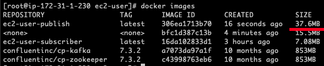

# OBU-pubsub

## Progress

- [x] Docker-compose 구성
- [x] Kafka 구성
- [x] Public to Kafka 
- [ ] Subscribe to Kafka 

## Execute

```sh
    ## in local
    make up

    ## in local 
    make scp-up
    ## in cloud
    make up
```

## Issue

### Golang Kafka Client 이슈 (완료)

- 이게문제가 뭐냐면
- go-kafka 같은 경우에는 C 라이브러리를 사용
- Go자체가 C 라이브러리를 사용하다록 설정이 되어있어야 함
- 그거와 더불어 몇몇개의 라이브러리를 사용해야 함 (pkgconf...)
- <a href="https://github.com/confluentinc/confluent-kafka-go#getting-started">Go-Kafka</a>

```Dockerfile
## Build Stage
FROM golang:1.21.5-alpine as builder

WORKDIR /usr/src/app

COPY go.mod go.sum ./

RUN go mod download

COPY . .

RUN apk --no-cache update && \
    apk --no-cache add git gcc libc-dev librdkafka-dev vips-dev pkgconf

## CGO_ENABLED : C 라이브러리 사용
ENV GO111MODULE=on \
    CGO_ENABLED=0 \
    GOOS=linux \
    CGO_ENABLED=1
# GOARCH=amd64

# RUN go build -o main .
# RUN go build -tags musl -o main .
RUN go build -tags dynamic -o main .

## Runner Stage
FROM scratch

WORKDIR /usr/src/app

COPY --from=builder /usr/src/app/main .

CMD ["./main"]
```

### Golang Multi Stage 배포 이슈 (완료)



- 앞서 C 라이브러리를 사용하는 Kafka Client를 사용함에 있어 필요한 라이브러리를 사용하고 
- 빌드된 바이너리 파일을 scratch 파일에 놨는데, 에러가 난다. (Symbol not found)
- 앞서 Build Stage에서 설정된 라이브러리들이 Runner Stage에서는 없어서 그런듯... -> 그냥 Build에서 실행시키면 800MB 임..
- Runner State에서 필요한 파일들만 당겨받자 (scratch -> alpine)

```Dockerfile
## Build Stage
FROM golang:1.21.5-alpine as builder

WORKDIR /usr/src/app

COPY go.mod go.sum ./

RUN go mod download

COPY . .

RUN apk --no-cache update && \
    apk --no-cache add git gcc libc-dev librdkafka-dev vips-dev pkgconf

RUN go build -tags dynamic -o main .

## Runner Stage
FROM alpine:latest

WORKDIR /usr/src/app

RUN apk --no-cache add libc-dev librdkafka-dev pkgconf
COPY --from=builder /usr/src/app/main .

CMD ["./main"]
```

### Golang Kafka Connection 이슈 (완료)

- 자꾸 Pubslih 서비스에서 Kafka로 Connection 이슈가난다
- 어차피 같으 network를 쓰기 때문에 locahost:9200 통신할텐데 왜이슈가 날까...

```yml
## ...
environment:
      - KAFKA_BROKER_ID=1
      - KAFKA_ZOOKEEPER_CONNECT=zookeeper:2181
      - KAFKA_LISTENER_SECURITY_PROTOCOL_MAP=PLAINTEXT:PLAINTEXT,PLAINTEXT_HOST:PLAINTEXT,PLAINTEXT_INTERNAL:PLAINTEXT
      - KAFKA_ADVERTISED_LISTENERS=PLAINTEXT://broker:9092,PLAINTEXT_INTERNAL://broker:29092 ## broker로 설정해줘야 함...
      - KAFKA_INTER_BROKER_LISTENER_NAME=PLAINTEXT_INTERNAL
      - KAFKA_OFFSETS_TOPIC_REPLICATION_FACTOR=1
      - KAFKA_TRANSACTION_STATE_LOG_MIN_ISR=1
      - KAFKA_TRANSACTION_STATE_LOG_REPLICATION_FACTOR=1
```
